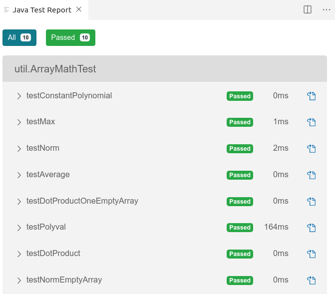

## JUnit Tests for Lab 2

This repo contains some JUnit tests for Stopwatch and ArrayMath.

```
stopwatch/StopwatchTest.java  - JUnit tests for Stopwatch
util/ArrayMathTest.java       - JUnit tests for ArrayMath
```
JUnit is the standard library for testing Java code.
The Python `unittest` module is based on JUnit and quite similar.

You can run these tests inside your IDE to verify your code.

### How to Use

Copy the unit test files into the same directory as your source code.
In BlueJ, use drag-and-drop so it "sees" the new file, or copy the 
file and then use `Edit -> Add Class from File...` to add the test
file to your project.

### Don't Add Test Classes to Git

Please don't add StopwathTest.java or ArrayMathTest.java to your git repo.

### Running Tests In BlueJ

* Drag-and-drop the test file into the same directory as your source code, or copy it into the directory and then use `Edit -> Add Class from File...` to add to your project.
* BlueJ shows test files as green file icons
* Right-click on a Test file and choose "Test All", or click the "Run Tests" button
* A pop-up window shows the results. Passing tests get a green check mark.

BlueJ project window showing test case:


Results of running unit tests. One test failed, 9 tests passed.


### Using JUnit in VS Code

VS Code requires some configuration to use JUnit.
It seems to require these extensions: 

* Java Extension Pack by Microsoft
* Language Support for Java by Red Hat
* Java Test Runner by Microsoft

as if that isn't enough work, you *might* need to 
install the JUnit libraries (2 JAR files) yourself.  See below.

Try running the tests without installing JUnit yourself.
If it doesn't work, then install JUnit as described below.

### Running Unit Tests in VS Code

1. Copy `StopwatchTest.java` to your stopwatch directory, and copy `ArrayMathTest.java` to your util directory.
2. Open a file in VS Code.  For ArrayMathTest.java it looks like this:    
    
3. Click on "Run Test" (right above the `public class` line).  In the status bar at bottom will be a message showing how many tests pass or fail:    
    
4. You can double-click on the status message to open a window of test results:    
    
5. If all the tests pass your code is probably correct.  JUnit only tests functionality, not code quality.

### Install JUnit 4 for VS Code

If VS Code can't find JUnit, then you may need to install the JUnit "jar" files and add them to your project references:
```
    junit-4.12.jar or junit-4.13.jar
    hamcrest-core-1.3.jar
```

Download them from: [https://junit.org/junit4/](https://junit.org/junit4/) which
has a [Download and Install](https://github.com/junit-team/junit4/wiki/Download-and-Install) link.
Download just the JAR files, don't use Maven or Gradle.

After you download `junit-4.12.jar` and `hamcrest-core-1.3.jar` 
you need to add them do your VS Code project "classpath".

There are 2 solutions:

1. Easy but need to do for each project:
    * inside your project create directory named `lib` (actually any name is OK)
    * copy junit-4.12.jar and hamcrest-1.3.jar to `lib`
    * close and reopen the project to update the "project dependencies"
2. Better solution but more work:
    * create a library directory for JUnit. For example, `c:\Program Files\Java\junit4` is OK. My directory is /opt/lib/junit.
    * copy junit-4.12.jar and hamcrest-core-1.3.jar to your junit4 directory.
    * In your VSCode project, edit the file `.vscode/settings.json` and add a line to the variable `java.project.referencedLibraries` like this:
    ```
    "java.project.referencedLibraries": [
          "/home/your_workspace/lab2/** /*.jar",
          "/opt/lib/junit4/*.jar"          <-- use the path to your junit jar files
     ]
    ```
    * Close the project and open it again is VS Code

After performing either of these, you should be able to run the tests.

If it doesn't work, try testing in BlueJ instead!
